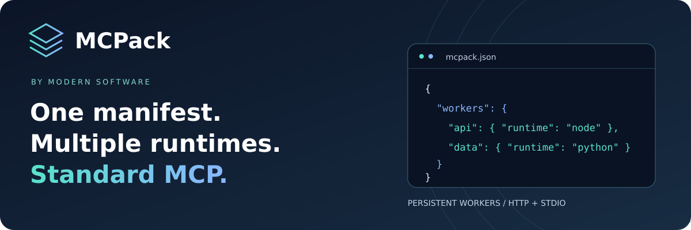
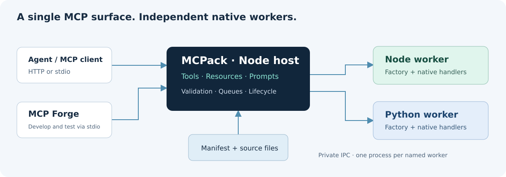

<p align="center">
  
</p>

<p align="center">
  <a href="https://github.com/ModernSoftware/mcpack/actions/workflows/ci.yml"></a>
  <a href="LICENSE"></a>
  
  
  
</p>

<p align="center">
  <a href="#run-the-example">Quick start</a> ·
  <a href="docs/contracts.md">Contracts</a> ·
  <a href="docs/http.md">HTTP & authentication</a> ·
  <a href="CONTRIBUTING.md">Contribute</a>
</p>

# MCPack

MCPack runs native MCP tools, resources, and prompts from a versioned project manifest. It keeps handler processes alive between calls and exposes their capabilities through the official TypeScript MCP SDK.

This alpha supports **Node and Python native workers**. Modern MCP Forge’s `v0.10.0` branch contains the first native integration; it is not yet a production release.

## Write handlers. Keep your runtime. Serve MCP.

| Capability           | What you get                                                         |
| -------------------- | -------------------------------------------------------------------- |
| 🧩 One manifest      | Declare tools, resources, prompts, entrypoints, and worker settings. |
| 🟢 Node + 🐍 Python  | Keep language-specific dependencies and persistent factory state.    |
| 🔌 Two transports    | Start a stdio server or a standalone Streamable HTTP endpoint.       |
| ⏱️ Bounded execution | Queue limits, deadlines, cancellation, and bounded shutdown.         |
| 🛠️ Develop in Forge  | Test the same native manifest and code used by the standalone CLI.   |



**MCPack owns native execution and deployment.** Modern MCP Forge provides the development
UI. External MCP connections and language bridges belong to Forge's integration roadmap;
MCPack does not bundle or proxy them.

## Run the example

Requires Node.js 22 or newer and npm. From the repository root:

```sh
npm ci
npm test
node dist/cli.js validate examples/hello/mcpack.json
node dist/cli.js serve examples/hello/mcpack.json
```

`serve` defaults to an MCP client on stdin/stdout. Add `--transport http --port 3000` for a standalone Streamable HTTP endpoint at `http://127.0.0.1:3000/mcp`. Configure a client with `node` as its command and absolute paths to `dist/cli.js` and the manifest:

```json
{
  "command": "node",
  "args": [
    "/absolute/path/mcpack/dist/cli.js",
    "serve",
    "/absolute/path/mcpack/examples/hello/mcpack.json"
  ]
}
```

The example provides `greet`, `mcpack://hello/guide`, and `welcome`. Repeated greetings return an increasing count and the same worker PID. A second persistent worker serves the resource and prompt.

## Author a native project

Keep a `mcpack.json` file alongside your handler code. A worker declares a runtime, source module, and factory. Tools, resources, and prompts bind to named handlers returned by that factory.

```json
{
  "schemaVersion": 1,
  "name": "my-server",
  "version": "1.0.0",
  "workers": {
    "main": { "runtime": "node", "module": "./handlers.mjs" }
  },
  "tools": [
    {
      "name": "greet",
      "worker": "main",
      "handler": "greet",
      "inputSchema": {
        "type": "object",
        "properties": { "name": { "type": "string" } },
        "required": ["name"],
        "additionalProperties": false
      }
    }
  ]
}
```

```js
// handlers.mjs
export async function createWorker(context) {
  // Open a database pool or initialize a client once here.
  let calls = 0;

  return {
    tools: {
      async greet({ name }, call) {
        call.signal.throwIfAborted();
        calls += 1;
        return {
          content: [{ type: 'text', text: `Hello, ${name}!` }],
          structuredContent: { calls },
        };
      },
    },
    async close() {
      // Close the pool/client here.
      context.log('Worker closed');
    },
  };
}
```

TypeScript projects compile handlers before execution and point `module` at the resulting JavaScript inside the project directory. There is no implicit TypeScript loader or build step. The exported `CreateWorker`, `NativeWorker`, `Handler`, and result types describe the authoring contract.

## Add Python to the same server

Python workers require Python 3.11 or newer; Node-only projects do not require Python.
The included runner uses only the Python standard library. Install your application’s
Python dependencies in its own environment, then select that environment’s interpreter:

```json
{
  "runtime": "python",
  "module": "./python_handlers.py",
  "executable": "./.venv/bin/python"
}
```

On Windows use `./.venv/Scripts/python.exe`. Paths are relative to the manifest;
absolute interpreter paths are also supported. Without `executable`, MCPack searches
PATH for `python3` on Unix or `python` on Windows. This is an executable path, not a shell
command; do not include arguments or quotes in its value.

```python
# python_handlers.py
def create_worker(context):
    def greet(args, call):
        call.signal.throw_if_aborted()
        return {"content": [{"type": "text", "text": f"Hello, {args['name']}!"}]}

    return {"tools": {"greet": greet}}
```

Factories, handlers, and cleanup hooks may be synchronous or async. The Python factory
returns a dictionary of handler maps with an optional `close` callable. Context uses
`worker_id`, `project_root`, `config`, `log`, and, for calls, `request_id` and `signal`.
See the [Python contract](docs/python.md) for lifecycle, imports, and result details.

After `npm run build`, try the mixed-language project:

```sh
node dist/cli.js validate examples/mixed/mcpack.json
node dist/cli.js serve examples/mixed/mcpack.json
```

It exposes Node’s `greet`, Python’s `summarize`, a Python resource, and a Python prompt
through one MCP server. Each worker remains alive across calls. The same manifest can
be loaded by Forge’s native integration after installing this MCPack revision locally.
The standalone CLI supports stdio and HTTP. Forge continues to own its separate Streamable HTTP endpoint and connects to MCPack over stdio.

## Embed the same runtime

Once the package is installed from a local tarball or workspace:

```ts
import { MCPackRuntime, createMcpServer } from '@modern-software/mcpack';

const runtime = await MCPackRuntime.load('/project/mcpack.json', {
  diagnostic: (worker, stream, text) => console.error(worker, stream, text),
});

try {
  await runtime.start();
  const result = await runtime.callTool('greet', { name: 'Diego' });
  console.log(result);
  // A host can also use createMcpServer(runtime) with an SDK transport.
} finally {
  await runtime.close();
}
```

Forge’s native prototype launches the MCPack CLI over stdio, using the same runtime and contracts. Other hosts can embed the API above directly. External MCP servers and language bridges remain Forge features; MCPack does not proxy or package them.

## Operating model

- One child process per named worker; one active call per process by default. Opt in with worker `maxConcurrent` to overlap I/O calls (see [concurrency contracts](docs/contracts.md#opt-in-concurrency)). Separate workers run concurrently. Each process has its own factory state.
- A bounded FIFO queue and deadline apply to every invocation. The deadline includes queue wait.
- Active cancellation, timeout, or process failure retires that worker. Other active and queued requests fail; other workers keep serving. There are no automatic retries or restarts. Recreate the runtime to recover a retired worker in this alpha.
- Graceful shutdown invokes `close()` with a bounded wait, then kills processes that do not exit. Forced shutdown cannot guarantee application cleanup or rollback of external writes.
- Worker responses default to a 1 MiB serialized envelope limit. Diagnostic delivery defaults to 64 KiB per worker per one-second window; dropped-byte counters are available in runtime health. See [limit semantics](docs/contracts.md#output-limits-and-compatibility).
- Worker stdout/stderr are diagnostics, separated from MCP protocol stdout. Treat diagnostics as potentially sensitive application output.
- Environment inheritance is explicit, apart from basic OS executable/temp variables. Use `inheritEnv` for credentials provided by your deployment environment. Do not put secrets in the manifest's literal `env` object.

## Scope and next steps

Implemented: manifest validation, Node/Python factories, persistent named workers, bounded queues, cancellation/deadlines, graceful shutdown, text tool/resource/prompt results, static discovery, stdio/Streamable HTTP serving, request admission limits, bearer authentication or a custom authorization hook, health probes, a benchmark harness, and an embedding API.

Not implemented: OAuth/tenant identity propagation, .NET workers, replicated worker pools, automatic recovery, hot reload, resource templates/subscriptions, binary or rich media results, output schemas, tasks, sampling, and elicitation. No latency or production-readiness claim is made yet.

Handler code is **trusted executable code**. A child process and a project-relative entrypoint are not a sandbox. Modules can import other files, access the network and filesystem, spawn children, and cause side effects. Use deployment isolation for untrusted code. Killing a worker does not manage arbitrary descendants it spawned.

## Distribution

The package is configured for public publication as **`@modern-software/mcpack`** under
**Apache-2.0**. Registry publication is a separate, manually controlled release step;
this README does not imply that the first alpha has been published.

Until the first release, use the repository or install an `npm pack` tarball.
After publication, install the alpha in your own project:

```sh
npm install @modern-software/mcpack@alpha
npx mcpack validate ./mcpack.json
npx mcpack serve ./mcpack.json --transport http --port 3000
```

Node and optional Python interpreters are deployment prerequisites, not bundled runtimes.

## Contributing

Start with an [issue](https://github.com/ModernSoftware/mcpack/issues), then submit a focused
pull request. See [CONTRIBUTING.md](CONTRIBUTING.md) for local checks and the
[repository workflow](docs/repository-governance.md) for branch protection.

## License

Copyright 2026 Modern Software and MCPack contributors. Licensed under the
[Apache License, Version 2.0](LICENSE). See [NOTICE](NOTICE).

See [contracts](docs/contracts.md), [architecture decisions](docs/architecture.md), and [implementation roadmap](docs/roadmap.md).

See [HTTP operation and authentication](docs/http.md), [performance measurements](docs/performance.md), and [npm release preparation](docs/releasing.md).
