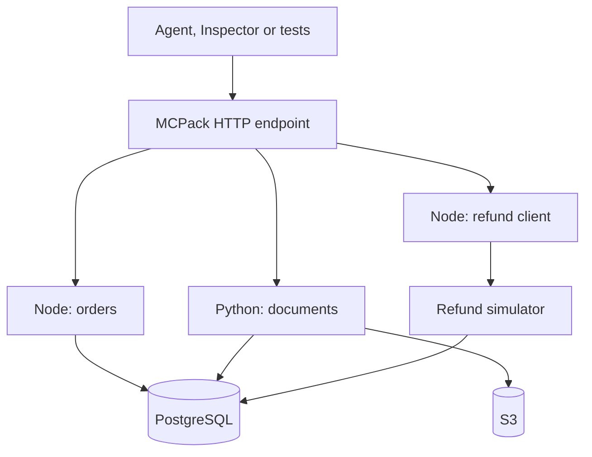

# One MCP server, two languages: building a support desk with MCPack

An order arrives damaged, a support assistant needs to find the order, locate its
invoice, read the returns policy, determine eligibility, and help an operator
request a refund. The useful work crosses a database, object storage and another
service, isn't that what a developer's daily life quickly became?

Now don't forget team work and individual capabilities, we can have different visions
and backgrounds, including expertise in different languages, platforms etc.

We built an experiment with **MCPack 0.9.0**, an Apache-2.0 library for running
manifest-defined MCP tools, resources and prompts with persistent Node and Python
workers. The library is available as
[`@modern-software/mcpack`](https://www.npmjs.com/package/@modern-software/mcpack).
The complete sample, Terraform and tests live in the
[MCPack repository](https://github.com/ModernSoftware/mcpack/tree/main/examples/support-desk).

Our goal was practical: keep application code in the language that suits it,
expose one MCP endpoint, and carry the same tool implementation from local testing
to an AWS deployment. MCPack hosts those capabilities; the agent and the business
rules remain separate parts of the application.

## What MCP adds, and what MCPack handles

**Model Context Protocol** gives clients a standard way to discover and use a
server's capabilities for AI applications. Tools perform operations, resources
expose contextual content, and prompts provide reusable message templates.
A client can inspect the catalog without embedding a custom integration for
each handler.

MCPack adds an execution layer behind that interface, a JSON manifest identifies
workers, code modules, handler names, argument schemas and execution limits.
Node owns the MCP endpoint and routes calls to the configured language processes.
It does not translate Python into JavaScript. Both interpreters must be installed,
along with the application's dependencies.

Workers are persistent: the host does not launch an interpreter for every call.
Factories can initialize connection pools once and retain state until shutdown or
restart. That lowers startup cost, but process memory is temporary; records that
must survive a restart belong in a database or another durable store.

## The experiment

We seeded 2,000 synthetic customers, 10,000 orders, order items and shipment events,
plus a historical rejected claim. Object storage holds 101 text invoices and a
policy. A fixed business date keeps eligibility tests repeatable. Refunds are
simulated, there is no real money or customer data.

| Worker    | Language | Responsibility                                                         |
| --------- | -------- | ---------------------------------------------------------------------- |
| Orders    | Node     | Search orders, inspect customers and orders, open claims in PostgreSQL |
| Documents | Python   | Find/read S3 documents and evaluate refund eligibility                 |
| Refunds   | Node     | Call a separate HTTP refund simulator and reconcile its status         |

The endpoint exposes nine tools, two resources and two prompts. The refund API
uses durable uniqueness constraints and its own database role. The agent uses
Strands with an AWS Bedrock model; Inspector and deterministic tests exercise the
same server without requiring a model.



The language boundary stays behind MCP. An agent calls a named tool with JSON
arguments; it does not need to know which interpreter executes that tool.

## From npm to a running server

The sample's application package pins the published version:

```json
{
  "dependencies": {
    "@modern-software/mcpack": "0.9.0"
  }
}
```

Of course there are more dependencies on the list. The committed
lockfile also pins transitive dependencies. The sample Dockerfile installs them
with `npm ci`; it does not compile the MCPack repository. Python application
dependencies have a separate hash-checked requirements file and virtual environment.

The server imports `serveHttp` and `bearerToken` from the public package. It loads
the manifest, configures host/origin checks and bounded request admission, and
closes the runtime on termination. Handlers are defined in the manifest rather
than inside the hosting library.

To witness the wonder just clone the repository, with Node and Docker Compose
installed run the following commands:

```bash
npm ci
bash examples/support-desk/scripts/local.sh
node examples/support-desk/test/integration.mjs
node examples/support-desk/test/load.mjs
```

The root install provides test-client dependencies. The container separately
installs the application's pinned package. Local PostgreSQL, an S3 emulator and
the simulator make this convenient if you don't want to spend a dime to test MCPack.
Initial image and dependency downloads still need internet access.

Connect the [Inspector](https://github.com/modelcontextprotocol/inspector) to `http://localhost:3000/mcp`
with the disposable local header `Authorization: Bearer local-mcp-only`.
The ports bind to loopback. Follow the [sample guide](https://github.com/ModernSoftware/mcpack/blob/main/examples/support-desk/README.md)
for the optional agent, setup details and teardown commands.

## Concurrency is a workload decision

MCPack defaults to one active request per worker. This preserves predictable
behavior for stateful handlers. A developer can opt into concurrent execution for
handlers that safely overlap I/O. The sample sets each of its three workers to
four active calls, with a bounded waiting queue; its HTTP host admits at most 32
in-flight requests.

These values are not requests-per-second guarantees. Database pool sizes,
query duration, downstream limits and payload sizes determine useful throughput.
Async concurrency also does not make CPU-heavy JavaScript parallel inside one
worker or make blocking Python code nonblocking. Separate processes or service
replicas are the relevant scaling tools for those workloads.

When a worker fails, optional bounded recovery can start a replacement. It does
not replay the interrupted operation, for the sake of safety you know, it is on your
hands to monitor failed tool execution, for instance, if a remote service committed a refund
before the connection failed, restarting a process cannot establish whether the
refund happened, that requires an application-level idempotency key and a status
lookup.

## The most valuable failure was in the agent workflow

In an early interactive run, the model found document references and proceeded
toward a refund without visibly reading the invoice and policy; yep you know, AI
isn't Intelligent enough just yet, but it does well so far. Discovery alone
was not evidence retrieval. A plausible final answer was not enough to establish
that the intended workflow had occurred.

So, we added a deterministic approval wrapper in the sample agent, it fetches the order
and claim, reads invoice and policy, checks eligibility and amount consistency,
and presents the evidence before asking the operator to type `APPROVE`.
Denial must produce no refund submission. After an uncertain response, the wrapper
reconciles status with the original key rather than generating a replacement.

Tests cover denial, approval, repeated approval and lost-response reconciliation.
The refund service independently enforces its business constraints, the wrapper
is still a client-side safeguard: another client holding the server's service
token can invoke the raw submission tool. Mandatory approval across all clients
would require a durable server-side authorization workflow.

The lesson is to put required invariants in application code and tests. An MCP
runtime can validate inputs and manage execution; it cannot infer what constitutes
a legitimate refund or guarantee that a model understands a policy, that's why
MCPack's still a success, it properly served what was asked to, the decisions
are LLM's business.

## What we measured

Two measurements answer different questions, a synthetic benchmark estimates
hosting overhead. The Support Desk load script measures one real application
read path: `get_order_details` over MCP HTTP and PostgreSQL.

The application run produced:

| Requests | Concurrent callers | Failures |    p50 |    p95 |    p99 | Requests/s |
| -------: | -----------------: | -------: | -----: | -----: | -----: | ---------: |
|      100 |                  4 |        0 | 202 ms | 452 ms | 886 ms |      18.09 |

Beware that this is a smoke measurement, not a capacity certification. Its supplied output
did not preserve endpoint, hardware, image digest or server sizing, so we cannot
attribute those numbers specifically to local Docker or AWS. It excludes model
inference and does not benchmark every tool or S3 access.

The recorded v0.9.0 candidate synthetic run used Linux, Node 24.19.0 and Python
3.12.14, with 100 measured calls per case after five warmups. Selected
single-caller no-op measurements were:

| Path           | Worker |      p50 |      p95 |
| -------------- | ------ | -------: | -------: |
| Direct runtime | Node   | 0.153 ms | 0.455 ms |
| Direct runtime | Python | 0.212 ms | 0.298 ms |
| Loopback HTTP  | Node   | 2.872 ms | 5.456 ms |
| Loopback HTTP  | Python | 2.195 ms | 2.761 ms |

The HTTP benchmark excludes TLS, authentication, databases and public-network
latency. The execution workspace reported an AMD EPYC host with nine logical
CPUs, but effective resource quotas and background contention were not captured.
The full 32-case matrix, environment, source fingerprint and saturation results
are in the [performance report](https://github.com/ModernSoftware/mcpack/blob/main/docs/performance.md).
These are historical candidate measurements, not a new benchmark of the registry
image or a comparison against other frameworks.

For a deployment decision, rerun representative operations from outside the
server's network, record versions, image digest, CPU/memory limits, worker and
connection-pool settings, request mix, latency percentiles and rejected requests,
include sustained load, failures and recovery. Short successful runs do not
establish maximum connections, catalog size, memory safety or linear scaling.

## Taking the same application to AWS

The accompanying Terraform experiment uses an HTTPS Application Load Balancer,
ECS Fargate, RDS PostgreSQL, S3, Secrets Manager and a separate internal refund
service. We exercised the AWS endpoint through the [Inspector](https://github.com/modelcontextprotocol/inspector)
and a Bedrock-backed agent using Noval Pro model, as well as running locally. The sample's
[AWS runbook](https://github.com/ModernSoftware/mcpack/blob/main/examples/support-desk/AWS.md)
builds the application image, pushes it to ECR and deploys by digest.

Bearer-token checks protect the MCP endpoint, TLS terminates at the load balancer,
Task roles provide AWS permissions, and separate database roles narrow access.
MCPack provides schema validation, host/origin controls and bounded queues,
requests, outputs and execution times. Worker processes are not security sandboxes
or per-worker memory quotas. Container/platform limits and trusted handler code
remain essential. The sample does not implement multi-user OAuth or tenant-level
authorization.

Observe that AWS resources are billable, the local route is intended for people who want to
explore without provisioning cloud services; the optional model can still incur
provider charges.

## What can be built next using MCPack

The same arrangement can support internal operations assistants, reservation
workflows, document lookup or data-service tooling. Teams can keep Node service
integrations and Python document/data logic behind one capability catalog, with
explicit runtime and application dependency ownership. We intend to add NET and Go
workers support in the near future to we can have a set of different tools, written in
different languages, providing different capabilities maintained by different people
all under the umbrella of MCPack, isn't that wonderful, so start using it now and next
time in your organization someone dares to say you're not inclusive you can showcase
MCPack and show how being different is not an issue anymore.

MCPack also underpins the native integration work in
[Modern MCP Forge](https://github.com/ModernSoftware/modern-mcp-forge), our development
UI. The broader Forge workflow—editing, testing and combining native capabilities
with external MCP servers and developer bridges—is ongoing work and deserves its
own article. MCPack deployment remains native-only; it does not become the Forge
aggregation gateway.

Try the sample, replace a handler with your own integration, and report the
workload and environment alongside any performance or reliability finding.
That kind of reproducible feedback is more useful than a universal
“production-ready” label.
