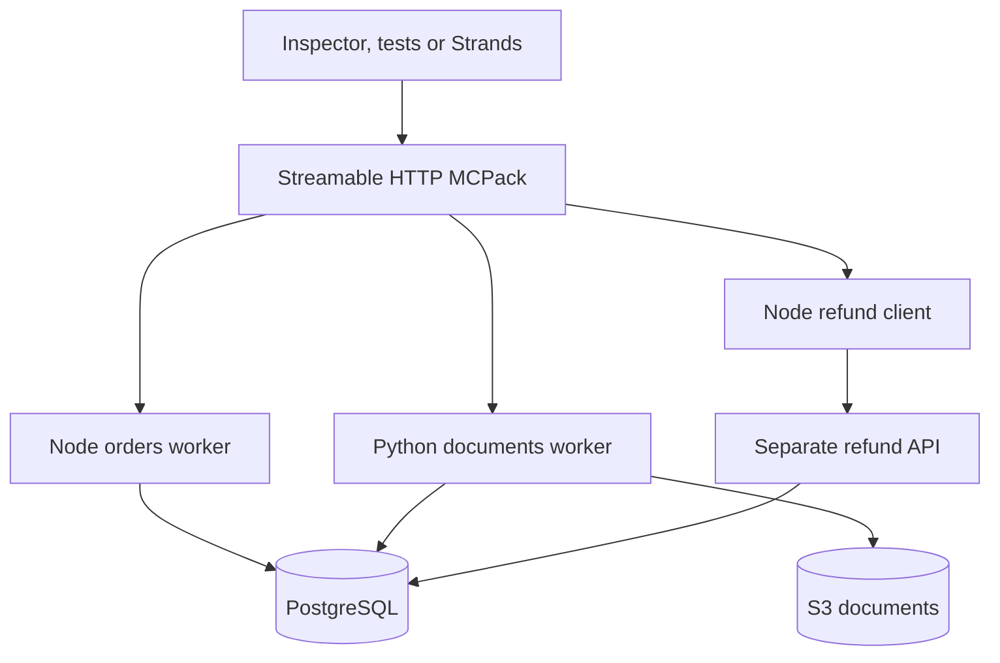

# Support Desk: MCPack in a realistic application

Investigate an order, find its invoice and policy, open a claim, and submit a
**simulated** refund. One MCP endpoint serves persistent Node and Python workers.
The same application runs locally or on AWS. No real customers or payments.

This sample builds MCPack from this checkout, so it tests the candidate code
before a release. It does not assume an unpublished `0.9.0` package exists.



## Run locally — no AWS account or model required

Prerequisites: Docker Engine/Desktop with Compose v2 and Linux containers,
Node 22+ and npm. On Windows use Git Bash for the shell commands.
From the **repository root**:

```bash
npm ci
bash examples/support-desk/scripts/local.sh
node examples/support-desk/test/integration.mjs
# Include the simulator's deliberately lost response after a successful commit:
REFUND_API_URL=http://localhost:3001 REFUND_API_TOKEN=local-refund-only \
  node examples/support-desk/test/integration.mjs
```

Connect Inspector to `http://localhost:3000/mcp` using
`Authorization: Bearer local-mcp-only`. Local ports bind to loopback only.
The hardcoded passwords/tokens are disposable local test credentials; never
reuse them for a remotely reachable deployment. PostgreSQL and Moto are not
published to the host. The local stack makes no AWS or model calls.

```bash
# Stop, preserving the database:
docker compose -f examples/support-desk/compose.yaml down
# Remove ALL local sample data:
docker compose -f examples/support-desk/compose.yaml down -v
```

Rerun `local.sh` to rebuild/start/reseed. Seeding preserves existing claims and
refunds; S3 documents are reuploaded because the emulator is ephemeral.
Docker images and dependencies require internet for the initial build.

## Dataset and capabilities

The deterministic seed creates **2,000 customers, 10,000 orders**, order items,
shipment events, one historical rejected claim, rejection reasons, and 102 S3
text documents (101 invoices and one policy). A fixed business date,
2026-01-31, keeps policy tests repeatable rather than aging out each month.
`ORD-10482` / `CUST-00482` is the main example. Its value is 1,482 cents.
Invoices are text to match the current text resource/result contract.

| Runtime | Tools                                                                    | Backing system    |
| ------- | ------------------------------------------------------------------------ | ----------------- |
| Node    | `find_orders`, `get_customer_summary`, `get_order_details`, `open_claim` | PostgreSQL        |
| Python  | `find_documents`, `read_document`, `evaluate_refund_eligibility`         | PostgreSQL + S3   |
| Node    | `submit_refund`, `get_refund_status`                                     | Separate HTTP API |

Resources: `support://policy`, `support://glossary`.
Prompts: `investigate_order`, `resolution_summary`.
Workers opt into four concurrent calls and bounded queues; each DB pool has
four connections. Adding replicas also adds pools: size the database accordingly.

Writes use parameterized SQL and durable uniqueness constraints. A claim has
one refund, and a refund idempotency key cannot be reused for another claim.
A lost HTTP response does not imply failure: query the same key before retrying.
MCPack recovery restarts workers; it does **not** replay operations.
The demo permits separate claims on the same order to keep tests repeatable;
this is not a real payment ledger or a complete anti-fraud policy.

## Optional Strands agent (model usage costs money)

The agent runs on your workstation and calls either endpoint. It requires Python
3.11+, AWS credentials with Bedrock model access, and an available model ID in
your region. Model output is not the deterministic release gate.

```bash
python -m venv examples/support-desk/agent/.venv
# Windows Git Bash: source examples/support-desk/agent/.venv/Scripts/activate
source examples/support-desk/agent/.venv/bin/activate
pip install --require-hashes -r examples/support-desk/agent/requirements.txt
export AWS_REGION=us-east-1
export BEDROCK_MODEL_ID='YOUR_ENABLED_MODEL_ID'
export MCP_URL=http://localhost:3000/mcp
export MCPACK_HTTP_TOKEN=local-mcp-only
python examples/support-desk/agent/main.py
```

The hashed dependency lock covers Linux and Windows, including Windows-only
transitive dependencies. After pulling a lockfile fix, rerun the install command
inside your activated virtual environment; keep `--require-hashes` enabled.
Maintainers can regenerate it with a universal resolution (uv 0.12.18):

```bash
uv pip compile examples/support-desk/agent/requirements.in --universal --python-version 3.11 --generate-hashes -o examples/support-desk/agent/requirements.txt
```

CI installs this lock and imports the agent on Linux/Windows with Python 3.11
and 3.13, without invoking a model. The Compose job also checks MCP discovery.

Try: “Investigate the damaged delivery for ORD-10482. Find its invoice and policy,
check eligibility, and help me request a refund.”

The agent exposes `approve_refund(order_id, claim_id, idempotency_key)` instead of
the raw submission tool. Its deterministic wrapper fetches the order and open
claim, discovers and **reads both invoice and policy**, checks eligibility and
amount consistency, and displays the complete evidence snapshot before asking
the operator to type `APPROVE`. Missing/failed evidence blocks submission. This
retrieval does not prove the model understood the documents; the operator sees
them for review, and the refund API independently enforces eligibility.

If submission raises an error or returns an unverified result, the wrapper queries
status with the original key. It reports `processed` only when the claim, key,
amount and processed status match. Otherwise it reports `unknown` and does not
resubmit. Repeated approval for the same claim in this agent session only checks
status; a changed key is rejected. Session tracking is in memory. After restarting
the agent, preserve the original claim/key and reconcile it before another action;
durable uniqueness remains in the refund API. Do not open a replacement claim to
bypass an uncertain outcome.

This is a **client-side workflow guard**, not additional MCPack authorization.
Server-side `confirmed: true` is not proof of human consent; another client holding
the service token can invoke the raw tool directly. This remains a trusted
support-operator sample, not a customer-facing multi-tenant/payment system.
Enforcing mandatory evidence/approval across all clients would require a durable
application-side approval record, beyond this sample's scope.

Run the approval unit tests without a model, database or cloud account:

```bash
python -m unittest discover -s examples/support-desk/agent -p "test_*.py" -v
```

With Compose running and the agent dependencies installed, test real MCP evidence
retrieval, denial and submission without a model (creates synthetic records):

```bash
MCPACK_HTTP_TOKEN=local-mcp-only python examples/support-desk/agent/smoke_refund.py
```

## AWS deployment

See [the deployment runbook](AWS.md). Terraform creates real, billable resources.
It is never applied by CI. An existing DNS name and issued ACM certificate are
required. The runbook separates provisioning, seeding and service startup.

## Formatting before pushing

Run from the repository root, using the lockfile-installed Prettier (3.6.2):

```bash
npm ci
npm run format
npm run format:check
```

These npm scripts check JavaScript, JSON, Markdown and other Prettier-supported
files. Terraform has a separate formatter; CI uses Terraform 1.13.5:

```bash
terraform fmt -recursive examples/support-desk/infra
terraform fmt -check -recursive examples/support-desk/infra
```

Review `git diff` and include the formatter's changes in your commit before
pushing. CI checks the committed files, not unsaved editor buffers or uncommitted
local fixes. If local results differ, compare `git rev-parse HEAD` with the failed
run's commit and run `npm exec -- prettier --version` from the root. An editor's
formatter or a global Prettier installation can differ from the pinned CLI.
Prettier may collapse short unbraced `if` statements onto one line; use braces
when you want an explicit multi-line block.

## Validation and release evidence

The `Support Desk PoC` GitHub workflow builds/runs Compose, exercises both
runtimes through the official MCP client, tests concurrent duplicate refunds and
lost-response reconciliation, and validates Terraform without AWS credentials.
The normal MCPack workflow still owns worker crash/recovery/timeout tests.

Before calling a release AWS-tested, run the same integration script against
HTTPS, run `test/load.mjs` from outside AWS, and record commit/image digest,
region, task sizing, latency percentiles, failures, and observations in the
issue. Test invalid tokens, blocked client IPs, a task restart and a rolling
update. Confirm no duplicate refund and check CloudWatch logs for secrets.
AWS deployment, Bedrock behavior, and production capacity are not certified by
local green tests. This sample intentionally omits multi-user OAuth, WAF,
autoscaling, multi-AZ RDS, disaster recovery, and a production payment provider.
